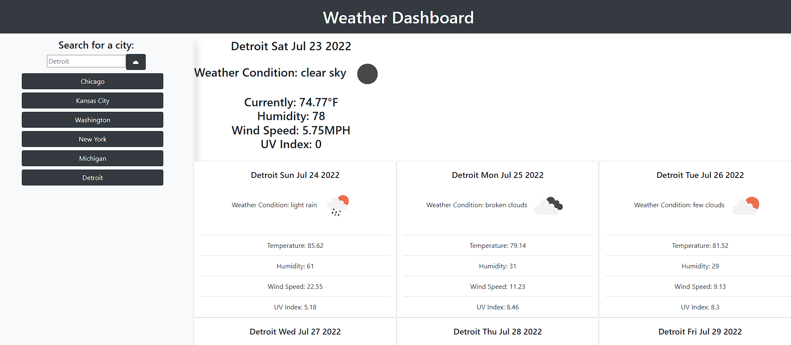

## Description
Live Link: (https://gavpo.github.io/weather-dashboard/)

This application was made to help people that are travelling by showing the current weather, as well as the weather forecast for the next week for the city of their coice. I learned a lot about using data from an API and making dynamic elements for each item in the API.

## Usage
Use this application to search a city and get it's current weather and weekly forecast. Just type into the search field and press the search button to get that cities weather. Searched cities will be saved under the search field, just press on the name of a city to see that cities forecast again.

## Screenshot

## License
MIT License

Copyright (c) [2022] [GavinOrlich]

Permission is hereby granted, free of charge, to any person obtaining a copy of this software and associated documentation files (the "Software"), to deal in the Software without restriction, including without limitation the rights to use, copy, modify, merge, publish, distribute, sublicense, and/or sell copies of the Software, and to permit persons to whom the Software is furnished to do so, subject to the following conditions:

The above copyright notice and this permission notice shall be included in all copies or substantial portions of the Software.

THE SOFTWARE IS PROVIDED "AS IS", WITHOUT WARRANTY OF ANY KIND, EXPRESS OR IMPLIED, INCLUDING BUT NOT LIMITED TO THE WARRANTIES OF MERCHANTABILITY, FITNESS FOR A PARTICULAR PURPOSE AND NONINFRINGEMENT. IN NO EVENT SHALL THE AUTHORS OR COPYRIGHT HOLDERS BE LIABLE FOR ANY CLAIM, DAMAGES OR OTHER LIABILITY, WHETHER IN AN ACTION OF CONTRACT, TORT OR OTHERWISE, ARISING FROM, OUT OF OR IN CONNECTION WITH THE SOFTWARE OR THE USE OR OTHER DEALINGS IN THE SOFTWARE.